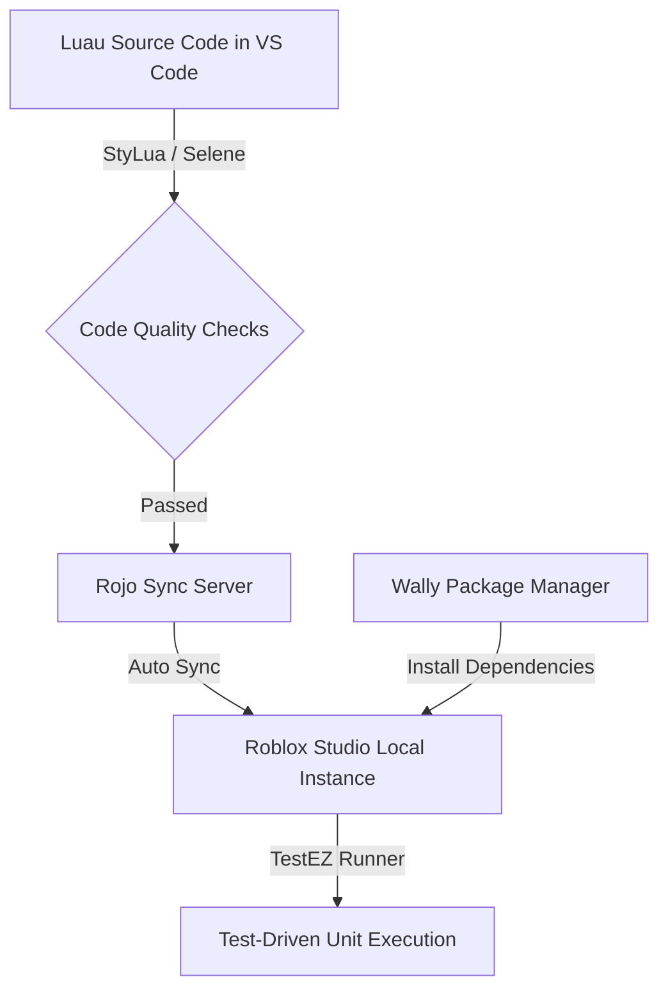

# Schritt 1.4: TDD-Framework & Toolchain-Spezifikation

> [!abstract] Zusammenfassung
> Dieses Dokument definiert das professionelle **Test-Driven Development (TDD) Framework** und die **Toolchain-Konfiguration** für *Gods & Icons: Tactical Tycoon & Creed*. Um eine lückenlose Qualitätssicherung und absolute Cheat-Resistenz in der Produktion zu gewährleisten, wird eine lokale Entwicklungsumgebung auf Basis von **Rojo**, **Wally**, **StyLua** und **Selene** etabliert. Die Kernlogik der Platzierungs-Validierung (`PlacementModule`) und des Latenz-Rollback-Systems (`RingBufferModule`, `RollbackModule`) wird über automatisierte **TestEZ**-Unit-Specs (sowohl positive Validierungen als auch Adversarial Attack-Vektoren) abgesichert.

---

## 🛠️ 1. Lokale Roblox-Entwicklungsumgebung & Toolchain

Die Toolchain entkoppelt die Entwicklung von der Roblox Studio Cloud und ermöglicht moderne Software-Engineering-Praktiken wie Git-Versionskontrolle, statische Code-Analyse und automatisiertes Testing.



### Rojo-Konfiguration (`default.project.json`)

Die Rojo-Projektdatei strukturiert die Synchronisation lokaler Verzeichnisse in die virtuelle Roblox-Hierarchy:

```json
{
  "name": "GodsAndIcons",
  "tree": {
    "$className": "DataModel",
    "ReplicatedStorage": {
      "$className": "ReplicatedStorage",
      "Shared": {
        "$path": "src/shared"
      },
      "Events": {
        "$className": "Folder",
        "InterventionRemote": {
          "$className": "RemoteEvent"
        },
        "PlacementRemote": {
          "$className": "RemoteEvent"
        }
      }
    },
    "ServerScriptService": {
      "$className": "ServerScriptService",
      "Server": {
        "$path": "src/server"
      },
      "Modules": {
        "$className": "Folder",
        "$path": "src/server/modules"
      }
    },
    "StarterPlayer": {
      "$className": "StarterPlayer",
      "StarterPlayerScripts": {
        "$className": "StarterPlayerScripts",
        "Client": {
          "$path": "src/client"
        }
      }
    }
  }
}
```

### Wally Package Manager (`wally.toml`)

Über Wally werden externe Bibliotheken wie TestEZ und Promise deklarativ verwaltet:

```toml
[package]
name = "gods-and-icons/core"
version = "0.1.0"
registry = "https://github.com/UpliftGames/wally-index"
realm = "shared"

[dependencies]
TestEZ = "roblox/testez@0.4.2"
Promise = "evaera/promise@4.0.0"
```

---

## 📐 2. Code-Qualitätssicherung: StyLua & Selene

Um Konsistenz und Typ-Sicherheit im gesamten Entwicklungs-Team zu erzwingen, werden Linter und Formatter streng konfiguriert.

### StyLua Formatter-Konfiguration (`stylua.toml`)

StyLua sorgt für standardisierte und performante Formatierung:

```toml
column_width = 120
line_endings = "LF"
indent_type = "Tabs"
indent_width = 1
quote_style = "AutoPreferDouble"
call_parentheses = "Always"

[sort_requires]
enabled = true
```

### Selene Linter-Konfiguration (`selene.toml`)

Selene analysiert den Luau-AST auf syntaktische und semantische Fehler:

```toml
std = "roblox"

[rules]
multiple_statements = "allow"
empty_if = "warn"
shadowing = "warn"
unbalanced_assignments = "error"
uppercase_local = "allow"
```

---

## 🛡️ 3. Adversarial Unit Spec: `PlacementModule.spec.lua`

Diese Testsuite läuft serverseitig und validiert die Integrität der Glaubenswirtschaft gegenüber bösartigen Client-Payloads (Adversarial Testing). Sie simuliert Type-Confusion-, Out-of-Bounds- und Rate-Limiting-Angriffe.

> [!IMPORTANT]
> Um eine 100-prozentige Server-Autorität zu verifizieren, dürfen Tests **niemals** den Client-seitig übermittelten Preis berücksichtigen, sondern müssen fehlschlagen oder den kanonischen Serverkatalog konsultieren.

```luau
--!strict
-- Platziert in: src/server/modules/PlacementModule.spec.lua
return function()
	local PlacementModule = require(script.Parent.PlacementModule)
	local PlayerDataStore = require(script.Parent.PlayerDataStore)

	-- Mocking-Infrastruktur für den Roblox Player
	local MockPlayer = {}
	MockPlayer.__index = MockPlayer

	local function createMockPlayer(userId: number, name: string): Player
		local self = setmetatable({
			UserId = userId,
			Name = name,
			ClassName = "Player",
			_attributes = { Belief = 1000 }
		}, MockPlayer)
		
		-- Registrierung im PlayerDataStore Mocking-Zweig
		PlayerDataStore.setPlayerState(self :: any, {
			Belief = 1000,
			Inventory = { ["old_forest_spirit"] = 1 }
		})
		
		return self :: any
	end

	function MockPlayer:GetAttribute(name: string)
		local state = PlayerDataStore.getPlayerState(self :: any)
		return state and state[name] or self._attributes[name]
	end

	function MockPlayer:SetAttribute(name: string, val: any)
		local state = PlayerDataStore.getPlayerState(self :: any)
		if state then
			state[name] = val
		else
			self._attributes[name] = val
		end
	end

	describe("PlacementModule - Adversarial Security Checks", function()
		local testPlayer: Player
		
		beforeEach(function()
			testPlayer = createMockPlayer(99999, "GottExploiter")
		end)

		it("sollte legitime Platzierungen erfolgreich durchführen", function()
			local request = {
				DeityId = "old_forest_spirit",
				GridCoords = Vector3.new(5, 0, 5),
				Rotation = 0
			}
			
			local success = false
			local err = nil
			
			success, err = pcall(function()
				PlacementModule.HandlePlacementRequest(testPlayer, request.DeityId, request.GridCoords, request.Rotation)
			end)
			
			expect(success).to.equal(true)
			
			local state = PlayerDataStore.getPlayerState(testPlayer)
			expect(state).to.be.ok()
			expect(state.Belief).to.equal(500) -- Kanonischer Preis (500) abgezogen
		end)

		it("sollte manipulierte Preissubventionen (Client-Side Price Spoofing) vollständig ignorieren", function()
			local request = {
				DeityId = "old_forest_spirit",
				GridCoords = Vector3.new(3, 0, 3),
				Rotation = 0,
				Price = 1 -- Versuchte Client-seitige Subventionierung!
			}
			
			-- Der Server darf keine "Price"-Variable aus der RPC-Schnittstelle akzeptieren!
			-- Die Platzierung wird ausgeführt, aber es MUSS der echte Serverkatalog-Preis (500) abgezogen werden.
			local success = pcall(function()
				PlacementModule.HandlePlacementRequest(testPlayer, request.DeityId, request.GridCoords, request.Rotation)
			end)
			
			expect(success).to.equal(true)
			local state = PlayerDataStore.getPlayerState(testPlayer)
			expect(state.Belief).to.equal(500) -- Abzug von 500, NICHT von 1!
		end)

		it("sollte Typ-Verwirrungs-Angriffe (Type-Confusion Attacks) abfangen ohne abzustürzen", function()
			local corruptRequest = {
				DeityId = 12345, -- Zahl statt String
				GridCoords = "Vector3(1,1,1)", -- String statt Vector3
				Rotation = "90Grad" -- String statt Zahl
			}
			
			local success = pcall(function()
				-- Erzwingung der Ausführung mit fehlerhaften Typen zur Prüfung des Type Guards
				PlacementModule.HandlePlacementRequest(testPlayer, corruptRequest.DeityId :: any, corruptRequest.GridCoords :: any, corruptRequest.Rotation :: any)
			end)
			
			-- Der Server darf NICHT abstürzen (muss robust abfangen)
			expect(success).to.equal(true)
			
			local state = PlayerDataStore.getPlayerState(testPlayer)
			expect(state.Belief).to.equal(1000) -- Wallet unberührt
		end)

		it("sollte Platzierungen außerhalb des Spielfelds (Out-Of-Bounds) blockieren", function()
			local outOfBoundsRequest = {
				DeityId = "old_forest_spirit",
				GridCoords = Vector3.new(99, 0, 5), -- Weit außerhalb des Spielfelds (z.B. max 10x10)
				Rotation = 0
			}
			
			PlacementModule.HandlePlacementRequest(testPlayer, outOfBoundsRequest.DeityId, outOfBoundsRequest.GridCoords, outOfBoundsRequest.Rotation)
			
			local state = PlayerDataStore.getPlayerState(testPlayer)
			expect(state.Belief).to.equal(1000) -- Wallet unberührt
		end)

		it("sollte Spam-Anfragen (Rate Limiting) serverseitig verwerfen", function()
			local request = {
				DeityId = "old_forest_spirit",
				GridCoords = Vector3.new(2, 0, 2),
				Rotation = 0
			}
			
			-- Simuliere 5 direkte, hochfrequente RPC-Anfragen auf demselben Thread
			for i = 1, 5 do
				PlacementModule.HandlePlacementRequest(testPlayer, request.DeityId, request.GridCoords, request.Rotation)
			end
			
			local state = PlayerDataStore.getPlayerState(testPlayer)
			-- Nur die allererste Platzierung durfte erfolgreich sein. Die restlichen 4 müssen blockiert werden.
			expect(state.Belief).to.equal(500) -- Genau eine Abbuchung
		end)
	end)
end
```

---

## ⚡ 4. Binärpuffer-Sicherheit Spec: `RollbackService.spec.lua`

Diese Suite verifiziert die binäre Integrität und die absolute Allokationsfreiheit des Ringpuffers bei extremen Netzwerkszenarien.

> [!TIP]
> Die Überprüfung auf Garbage-Collection (GC) Belastung erfolgt über das Verhältnis von Luau-Speicher vor und nach großen Schreibzyklen mittels `gcinfo()`.

```luau
--!strict
-- Platziert in: src/server/modules/RingBufferModule.spec.lua
return function()
	local RingBufferModule = require(script.Parent.RingBufferModule)

	describe("RingBufferModule - Binäre Speicherintegrität & GC-Hygiene", function()
		it("sollte Frame-Daten ohne Heap-Allokationen schreiben und historisch korrekt entpacken", function()
			local mockEntities: { [number]: RingBufferModule.EntitySlot } = {}
			for i = 1, 18 do
				mockEntities[i] = {
					Active = 1,
					CatalogIndex = 12,
					OwnerUserId = 99999,
					TileIndex = i,
					Health = 100.0,
					ActionPoints = 4,
					StatusMask = 0
				}
			end
			
			-- 1. GC-Ausgangszustand messen
			task.wait(0.1) -- Ermöglicht eventuell ausstehende Aufräumvorgänge
			gcinfo() -- GC initial triggern/bereinigen
			local memoryBefore = gcinfo()
			
			-- 2. Schreibe 1.000 Frames im simulierten 60 Hz Loop
			for tick = 1, 1000 do
				RingBufferModule.writeFrame(tick, os.clock(), mockEntities)
			end
			
			local memoryAfter = gcinfo()
			local diffMemory = memoryAfter - memoryBefore
			
			-- Es darf absolut kein GC-Druck aufgebaut werden (Heap-Wachstum = 0 KB)
			expect(diffMemory <= 1).to.equal(true) -- Erlaube Toleranz kleiner 1KB für grundlegende Engine-Schwankungen
			
			-- 3. Historische Genauigkeit prüfen (Modulo-Lookup)
			-- Frame 990 muss perfekt lesbar sein, da er innerhalb der 90-Frame-Historie liegt
			local historicalFrame = RingBufferModule.readFrame(990)
			expect(historicalFrame.Tick).to.equal(990)
			expect(historicalFrame.Entities[5].Active).to.equal(1)
			expect(historicalFrame.Entities[5].TileIndex).to.equal(5)
			expect(historicalFrame.Entities[5].Health).to.equal(100.0)
		end)

		it("sollte abgelaufene Ticks (Puffer-Überschreibung) sicher erkennen und abweisen", function()
			-- Wir schreiben tick 1 bis 200. Da der Puffer maximal 90 Frames speichert,
			-- muss Tick 10 längst überschrieben worden sein!
			for tick = 1, 200 do
				local dummyEntities = {}
				RingBufferModule.writeFrame(tick, os.clock(), dummyEntities :: any)
			end
			
			-- Versuch, den uralten, überschriebenen Frame 10 auszulesen
			local expiredFrame = RingBufferModule.readFrame(10)
			
			-- RingBufferModule muss erkennen, dass die geladene ID (200 % 90) nicht 10 entspricht und Tick = -1 zurückgeben
			expect(expiredFrame.Tick).to.equal(-1)
		end)
	end)
end
```

---

## 🧪 5. TDD-Verifikationsplan & CI/CD Integration

Um das TDD-Modell operativ wirksam zu machen, wird folgende Validierungs-Infrastruktur empfohlen:

### 1. Test-Runner in Roblox Studio

Um die Spezifikationen direkt in der lokalen Engine-Instanz auszuführen, wird ein temporärer Bootstrapper in `ServerScriptService` platziert:

```luau
--!strict
-- Platziert in: ServerScriptService.TestRunner.server.lua
local ReplicatedStorage = game:GetService("ReplicatedStorage")
local ServerScriptService = game:GetService("ServerScriptService")

-- TestEZ über Wally laden
local TestEZ = require(ReplicatedStorage.Packages.TestEZ)

print("--------------------------------------------------")
print("[TDD RUNNER] Starte automatisierte Unit-Tests...")
print("--------------------------------------------------")

local results = TestEZ.run(ServerScriptService.Server)

if results.failureCount > 0 then
	warn(string.format("[TDD FAILED] %d Tests sind fehlgeschlagen!", results.failureCount))
else
	print("[TDD PASSED] Alle TestEZ-Unit-Specs wurden erfolgreich verifiziert!")
end
print("--------------------------------------------------")
```

### 2. CI/CD Integration (GitHub Actions)

Jeder Push in das Git-Repository führt die Tests automatisiert in einer Sandbox mittels **Lune** (CLI Luau-Runtime) oder einer headless Roblox-Instanz aus:

```yaml
name: Luau CI & Test Execution

on: [push, pull_request]

jobs:
  validate:
    runs-on: ubuntu-latest
    steps:
      - name: Checkout Code
        uses: actions/checkout@v3

      - name: Install Toolchain (Aftman)
        uses: ok-collab/setup-aftman@v0.3.0

      - name: Install Wally Packages
        run: wally install

      - name: Code Formatting Check
        run: stylua --check src/

      - name: Static Analysis Linter
        run: selene src/

      - name: Headless Unit-Tests Execution
        run: lune run tests/run-specs.luau
```
