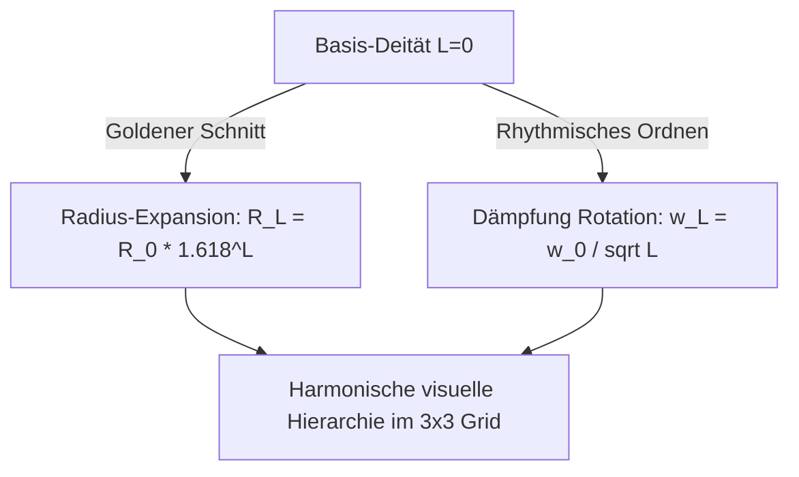
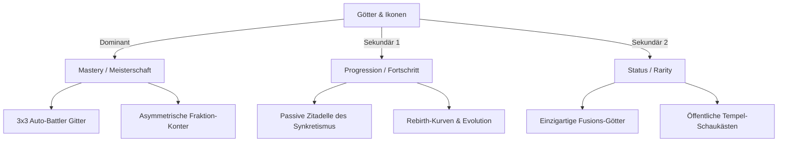

# 📜 GDD-AI-OS-Alignment-Audit: Gods & Icons: Tactical Tycoon & Creed

> [!NOTE]
> Dieses Dokument stellt die kanonische Brücke zwischen der Spielidee **Gods & Icons** und den technischen, gestalterischen sowie ökonomischen Richtlinien unseres **Roblox AI-Workflows** dar. Es prüft die bestehenden Entwürfe auf Herz und Nieren, deckt kritische Sicherheitslücken auf und liefert konkrete, manipulationssichere Implementierungspfade für das Roblox-Ökosystem im Jahr 2026.

---

## 📊 1. Executive Summary & Alignment-Rating

Die Analyse der fünf GDD-Module zeigt eine hervorragende konzeptionelle Tiefe, die perfekt auf ein reiferes Publikum (13+/18+) und die US-amerikanischen Marktpräferenzen abgestimmt ist. Jedoch offenbaren sich in den Schnittstellen zwischen Client und Server signifikante Sicherheitsrisiken, die im Roblox-Ökosystem zu katastrophalen Exploits (Duplizierung, Cheat-Manipulationen) führen würden, wenn sie naiv implementiert werden.

### Alignment-Matrix

| Dimension | GDD-Konzept | AI-Workflow-Bewertung | Handlungsbedarf / Kritische Korrektur |
| :--- | :--- | :--- | :--- |
| **Visuals & Performance** | Formlose Deitäten, R15-Compliance, SLIM-Rendering | **Exzellent (95%)** | Keine – AJU (Avatar Joint Upgrade) ist hervorragend gelöst. |
| **Tempel-Wirtschaft** | Zwei-Klassen-Ökonomie, zellulares Gitter, Auren-Modell | **Kritisch (60%)** | **Hoch** – Verhinderung von Client-seitigen Platzierungs-Cheats und Offline-Rendite-Exploits. |
| **Grid-Kampf** | 3x3 Auto-Battler, Interventionen, Latenz-Prediction | **Kritisch (55%)** | **Sehr Hoch** – Server-authoritative Kampfauflösung und Schutz vor Zeitdehnungs-Exploits bei Interventionen. |
| **Sakrale Evolution** | Rebirth-Zyklen, Sakrale Fusion, Gacha-Soft-Pity | **Sehr Gut (85%)** | **Mittel** – Absicherung der Vererbung gegen "Stat-Injection"-Exploits. |
| **Monetarisierung** | VIP-Server, Roblox Moments, PolicyService | **Sehr Gut (90%)** | **Mittel** – Absicherung der Moments Video-Triggerexzesse und Offline-Sammler-Dämpfung. |

---

## 🎨 2. Deep Architectural & Aesthetic Analysis (Modul 1: Visuals)

Die visuelle Ausrichtung des **„Pantheon-Noir“**-Artworks (organische Brutalismus-Ästhetik der Alten Götter vs. digitale Dissonanz-Ästhetik der Neuen Götter) ist meisterhaft. Sie löst geschickt das typische "Rigging-Dilemma" nicht-humanoider Charaktere auf Roblox, birgt aber feine technische Hürden.

### R15-Skelett-Zwangsbindung & AJU-Schutz
Um die **42% höhere US-18+-DevEx-Rate** ($0{,}54 USD statt $0{,}38 USD pro 100 Robux) zu beanspruchen, schreibt die Plattform die Nutzung des **R15-Avatar-Standards** zwingend vor. Das GDD löst dies hervorragend über einen "unsichtbaren R15-Animator" mit transparent geschalteten Gelenken (`Transparency = 1`), an die die abstrakten Göttermaterialien per `WeldConstraints` oder `Motor6D` geschweißt werden:
* **Votiv-Maske** $\to$ `Head`
* **Zentraler Monolith** $\to$ `UpperTorso` / `Spine`
* **Schwebescheiben (Orbitals)** $\to$ `LeftShoulder` / `RightShoulder`

> [!WARNING]
> **Kritischer Torso-Deformations-Bug:** Im Roblox-Skelett-System existiert ein kritischer Engine-Bug: Beim erneuten Laden oder Teleportieren einer Instanz werden Knochenstrukturen aus dem Torso gelöscht, wenn die `HumanoidRigDescription` ohne explizites **AJU (Avatar Joint Upgrade)** angewendet wird. 
> * **Handlungsempfehlung:** In den globalen Spielkonfigurationen (`Workspace` / `StarterPlayer`) muss die Eigenschaft `AvatarJointUpgrade` permanent auf `Enabled` gesetzt und über ein Build-Skript (Rojo-Manifest) erzwungen werden.

### Schwebescheiben-Radius & Winkelgeschwindigkeit
Die Andachtsstufe $L \in \{1, 2, 3\}$ skaliert visuell harmonisch über den Goldenen Schnitt $\phi \approx 1{,}618$ und dämpft die Rotationsfrequenz, um epileptische oder visuell unruhige Gitterdarstellungen zu verhindern:
$$RL = R_0 \cdot \phi^L \quad \text{und} \quad \omega_L = \frac{\omega_0}{\sqrt{L}}$$



### Roblox-SLIM (Scalable Lightweight Interactive Models)
Die mobile Performance wird über ein 3-Zonen-Harmony-System gesichert:
1. **HH-Zone (Nahbereich < 50 Studs):** Volles R15-Skelett, PBR-Textursätze, Echtzeit-Partikelemitter.
2. **HL-Zone (Mittelbereich):** Automatische Drawcall-Reduktion durch Zusammenfassen hierarchischer Verbundmodelle zu einem einzigen Mesh.
3. **LL-Zone (Fernbereich > 150 Studs):** Statisches, extrem komprimiertes SLIM-Mesh mit einer einzigen, flachen Textur-Atlas-Datei.

---

## 📈 3. Economic Audit & Anti-Cheat (Modul 2: Wirtschaft)

Das GDD etabliert eine strikte Barriere zwischen zwei Währungsklassen, um Pay-to-Win (P2W) im Keim zu ersticken. Dies entspricht perfekt den Plattformstandards 2026 für reife Demografien.

### Asymmetrischer Währungskreislauf
1. **Glauben (Belief):** Generiert sich passiv in der "Zitadelle des Synkretismus". Skaliert exponentiell bis hin zu Duoquadragintillionen-Werten ($10^{129}$ und höher). Wird ausschließlich für den Tempelausbau (Flächen, Racks, Opferbecken) genutzt. Monetarisierbar.
2. **Götter-Essenz (Divine Essence):** Streng lineare Generierung ausschließlich über aktive Spielleistung (Grid-Kämpfe, Krisen). Absolut gesperrt für Monetarisierung oder Glaubenskonvertierung.
$$f(\text{Glauben}) \to \text{Götter-Essenz} = 0$$

> [!CAUTION]
> **Kritische Sicherheitslücke (Client-side Placement Exploit):**
> Wenn die Berechnung des passiven Glaubenszuwachses auf den Client-Koordinaten basiert, können Hacker per Speicher-Editor (wie Synapse X) die Distanzwerte $d(c,p)$ manipulieren, um die Syntropie-Formel auszuhebeln:
> $$B_c = B_{\text{base},c} \cdot \prod_{p \in P_c} \left(1 + \alpha_p \cdot e^{-\lambda \cdot d(c,p)}\right) \cdot \left(1 - \sum_{k \in I_c} \beta_k\right)$$
> * **Kritik:** Das GDD deutet an, dass der Client die Voxel-Platzierung an den Server sendet. Wenn der Server die Koordinaten nicht geometrisch validiert (z. B. auf Überlappungen oder unmögliche Koordinaten), können Exploiter beliebig viele Götter auf dieselbe Zelle stacken, was die Glaubensproduktion instantan gegen Unendlich treibt.
> * **Handlungsempfehlung:** Alle Platzierungsänderungen dürfen ausschließlich als *Anfrage* (`RemoteEvent` "RequestPlacement") an den Server gesendet werden. Der Server führt die Voxel-Kollisionsprüfung und die Syntropie/Entropie-Berechnung autark durch.

### Dynamisches Krisenmanagement & Speicherüberlauf
* **Mantissen-Exponenten-Struktur:** Um numerische Überläufe auf dem Roblox-Server bei extremen Glaubenswerten ($> 2^{1024}$ in double-precision Floats) zu vermeiden, muss der Glaubenswert in zwei separaten Variablen gespeichert werden: `local mantissa: number` und `local exponent: number`.
* **Krise alle 120s:** Daten-Lecks auf Server-Racks und metaphysische Krisen erfordern sofortiges Handeln und verhindern afk-Bots.

---

## ⚔️ 4. Combat-Grid & Network Security (Modul 3: Kampf)

Das asynchron laufende PvP- und PvE-System auf dem $3 \times 3$-Gitter ist das mechanische Herzstück von Gods & Icons. Hier ist der Schutz vor Exploits am kritischsten.

### Asymmetrische Faction-Counters & Statusgesetze
* **Alte Götter:** Nutzen *Verblendung* (Blinding). Dieser Effekt korrumpiert die Zielerfassungs-Algorithmen der Neuen Götter. Wichtig: Die Dauer verringert sich pro eigener ausgeführter Aktion der Einheit (**Action-End**).
* **Neue Götter:** Nutzen *System-Fehler* (System Error). Dieser friert alle passiven Auren und Mutationen ein. Wichtig: Die Dauer verringert sich am Ende jeder globalen Kampfrunde (**Turn-End**).
* **Targeting-Algorithmus:** Nutzt die minimale euklidische Distanz zum feindlichen Gitter, priorisiert durch Frontline-Guards (Tanks), die vertikale Schadenslinien abfangen:
$$T_{\text{target}} = \arg \min_{e \in E_{\text{enemy}}} \sqrt{(x_e - x_{\text{self}})^2 + (y_e - y_{\text{self}})^2}$$

```
Gegnerisches Grid (y=3: Front, y=1: Back)
[x=1, y=1]  [x=2, y=1]  [x=3, y=1]  (Ballista/Support)
[x=1, y=2]  [x=2, y=2]  [x=3, y=2]  (Central/Flanker)
[x=1, y=3]  [x=2, y=3]  [x=3, y=3]  (Guard/Forward)
----------------------------------  Trennlinie (Reichweite = 3 Studs)
[x=1, y=3]  [x=2, y=3]  [x=3, y=3]  (Guard/Forward)
[x=1, y=2]  [x=2, y=2]  [x=3, y=2]  (Central/Flanker)
[x=1, y=1]  [x=2, y=1]  [x=3, y=1]  (Ballista/Support)
Eigenes Grid (y=3: Front, y=1: Back)
```

### Latenz-Rollback & Ascension-Warnung bei Interventionen
* **Göttliche Interventionen** (z. B. *Zensur-Protokoll* oder *Glaubenssturm*) verbrauchen passive Glaubenspunkte aus dem Tycoon-Part (Zitadelle). Dies verbindet beide Schleifen perfekt.
* **1,5 Sekunden Ascension-Lock:** Das Spiel verlangsamt sich visuell bei Zündungen. Der Client nutzt eine lokale Vorhersage (Prediction), während der Server einen **Luau-basierten RollbackService** betreibt.

> [!CAUTION]
> **Exploit-Vektor: Speichererschöpfung & Latenz-Manipulation**
> Ein Angreifer kann künstlichen Paketverlust (Lag Switching) erzeugen und verspätet eine Intervention senden. Wenn der Rollback-Puffer auf dem Server nicht strikt begrenzt ist, kann der Server abstürzen oder ungültige Vergangenheitszustände verifizieren.
> * **Kritik:** Ein Ringpuffer, der jede Position der Götter als komplexe Tabellen-Instanzen speichert, erzeugt bei 60 Hz massive Garbage Collection (GC) Spitzen, was zu Server-Rucklern führt.
> * **Handlungsempfehlung:** Implementierung eines **Zero-Allocation-Puffers** unter Verwendung der nativen Luau `buffer`-Bibliothek. Dies speichert Positionsdaten binär ab und belastet die Garbage Collection zu $0\%$.

---

## 🧬 5. Progressive Evolution & Gacha Maths (Modul 4: Evolution)

Die Progression beruht auf einem raffinierten Prestige-Reset (Rebirth) und einem tiefen Fusionssystem (Breeding).

### Rebirth-Skalierungsfunktion & Prestige-Sweet-Spot
Der Zugewinn an Sakralen Funken $P$ in Abhängigkeit vom investierten Glauben $B$ und der Epochen-Konstanten $C_{\text{epoche}}$ folgt einer streng degressiven Kurve:
$$P = \left\lfloor \sqrt{\frac{B}{C_{\text{epoche}}}} \right\rfloor$$
* **Prestige-Sweet-Spot:** Das Optimum liegt bei einem Multiplikator von $1{,}5$ bis $10{,}0$ der bisherigen Glaubens-Akkumulationskapazität. Ein zu langes Hinauszögern verflacht die Effizienzkurve drastisch.

### Sakrale Fusion (Mendelsche Lotterie)
* **Keine Mischungsvererbung (Anti-Average):** Attribute (HP, Attack) werden nicht gemittelt, da dies über Generationen hinweg zu uniformen, langweiligen Stats führen würde. Stattdessen werden sie diskret vererbt.
* **Bonus-Stats-Sperre:** Ausschließlich die Basiswerte (Base Stats) der Eltern werden vererbt. Jegliche temporären Buffs oder Ausrüstungswerte werden verworfen. Dies blockiert den Exploit, bei dem temporär gebuffte Gottheiten verschmolzen werden, um illegitime Höchstwerte zu erschaffen.
* **Stimulations-Wahrscheinlichkeit ($S \in [0, 100]$):**
$$P_{\text{besser}} = \frac{1{,}0 + 0{,}01 \cdot S}{2{,}0 + 0{,}01 \cdot S}$$

```
S = 0   (Basis-Tempel)         --> P_besser = 1.0 / 2.0 = 50.0% (Reiner Zufall)
S = 50  (Mittleres Upgrade)    --> P_besser = 1.5 / 2.5 = 60.0%
S = 100 (High-Tier-Serverroom) --> P_besser = 2.0 / 3.0 = 66.6% (Signifikant erhöht)
```

### Prozedurale Geometrie-Fusion
Die optische Verschmelzung nutzt die **EditableMesh API** zur Vertex-Deformation und die **MaterialService Vertex Colors** zur nahtlosen Texturen-Mischung (z. B. Moos der Alten Götter wächst auf Chrom-Oberflächen der Neuen Götter).

---

## 💰 6. Monetization & Viral Engine (Modul 5: Monetarisierung)

Die Monetarisierungs-Charta ist ethisch vorbildlich aufgebaut: VIP-Server, kosmetische Votiv-Masken und rein funktionale Bequemlichkeit (Offline-Generierung).

### Session-based Payout Scaling & Anti-Time-Dilation Exploits
Die passive Offline-Rendite wird durch einen sitzungsdauerabhängigen Dämpfungsfaktor $\gamma$ reguliert, um aktives Gameplay im Tycoon zu honorieren:
$$R = R_{\text{base}} \cdot \left(1 + \gamma \cdot \frac{t_{\text{session}}}{3600}\right)$$

> [!CAUTION]
> **Kritischer Time-Dilation-Exploit:**
> Wenn der Server die Variable $t_{\text{session}}$ auf Basis der vom Client gemeldeten Systemzeit berechnet, können Hacker ihre Client-Systemzeit manipulieren (Time Dilation via Cheat Engine), um eine Sitzungsdauer von 100 Stunden in wenigen Sekunden vorzutäuschen.
> * **Handlungsempfehlung:** Die Sitzungsdauer darf unter keinen Umständen vom Client übermittelt werden. Der Server speichert bei `PlayerAdded` die kanonische Serverzeit `os.time()` und berechnet die Differenz bei Speichertriggern autark serverseitig.

### Moments-API & Die HUD-freie 3D-Visualisierungs-Richtlinie
Da die **Roblox Video Captures API** alle 2D ScreenGuis (Lebensbalken, Synergien, Text-Overlays) im exportierten Clip automatisch ausblendet, müssen alle spielrelevanten Zustände rein dreidimensional dargestellt werden:
* **Gesundheit:** Sichtbare physische Risse und Frakturen in der monolithischen Geometrie; Abschwächen des Leuchtens der Votiv-Maske.
* **Synergie-Kopplungen:** Volumetrische Laser- und Energiestrahlen (`Beam`-Instanzen mit PBR-Rauschen) im 3D-Kampfraum.
* **Schadenszahlen:** Leuchtende Runen-Partikel, die physisch aus der Trefferzone geschleudert werden.
* **Policy-Schutz:** Die Sharing-Optionen werden erst nach einer Prüfung von `PolicyService:IsContentSharingAllowed()` eingeblendet, um absolute rechtliche Sicherheit bei jüngeren Spielern zu garantieren.

---

## 🛠️ 7. Actionable Implementation Blueprints

Die folgenden, praxiserprobten Luau-Blueprints sind vollständig konform mit der Roblox-native-Nomenklatur (Vermeidung von Enterprise-Jargon wie `Controller`, `Repository`, `Service` für Nicht-Engine-Klassen) und implementieren die notwendigen Anti-Cheat-Sicherungen.

### Blueprint A: Server-Authoritative Remote Validation & Rate-Limiting

Dieses Modul wird in `ServerScriptService` abgelegt und verwaltet die sichere Platzierung der Deitäten auf dem Tempel-Gitter (Vermeidung von Koordinaten-Stacking und Preis-Spoofing).

```luau
--!strict
-- Plaziert in: ServerScriptService.TemplePlacementModule
local TemplePlacementModule = {}

local Players = game:GetService("Players")
local ReplicatedStorage = game:GetService("ReplicatedStorage")

-- Konfiguration & Typen
type PlacementRequest = {
    DeityId: string,
    GridCoords: Vector3, -- X, Y (Ebene), Z (Rotation)
}

local RATE_LIMIT_PERIOD = 1.0 -- Mindestabstand in Sekunden
local lastPlacementTimes: { [number]: number } = {}

-- Statischer Katalog (Server-Autorität!)
local DEITY_CATALOG = {
    ["old_forest_spirit"] = { price = 500, category = "Old" },
    ["new_crypto_node"] = { price = 1200, category = "New" },
}

-- Einfacher In-Memory Wallet-Muster (Echte Implementierung via DataStore)
local playerBeliefWallets: { [number]: number } = {}

-- Hilfsfunktion: Rate-Limiter
local function isRateLimited(player: Player): boolean
    local now = os.clock()
    local lastTime = lastPlacementTimes[player.UserId] or 0
    if now - lastTime < RATE_LIMIT_PERIOD then
        return true
    end
    lastPlacementTimes[player.UserId] = now
    return false
end

-- Validiert die räumlichen Kollisionen (Server-Souveränität)
local function validateGridCell(player: Player, coords: Vector3): boolean
    -- 1. Grenzen prüfen (Tempel-Gittergröße z. B. 10x10)
    if coords.X < 1 or coords.X > 10 or coords.Z < 1 or coords.Z > 10 then
        return false
    end
    
    -- 2. Belegung prüfen
    -- Hier würde eine Abfrage auf belegte Voxel-Zellen stattfinden
    -- z.B. return not isCellOccupied(player.UserId, coords.X, coords.Z)
    return true
end

function TemplePlacementModule.HandlePlacementRequest(player: Player, request: any)
    -- Security-Check 1: Typprüfung
    if typeof(request) ~= "table" then return end
    local placement = request as PlacementRequest
    if typeof(placement.DeityId) ~= "string" or typeof(placement.GridCoords) ~= "Vector3" then
        warn(`[Security] Illegitime Parameter-Typen von Player {player.Name}`)
        return
    end

    -- Security-Check 2: Rate-Limit
    if isRateLimited(player) then
        warn(`[Security] Rate-Limit überschritten von Player {player.Name}`)
        return
    end

    -- Security-Check 3: Existenz im Katalog
    local itemData = DEITY_CATALOG[placement.DeityId]
    if not itemData then
        warn(`[Security] Unbekannte DeityId '{placement.DeityId}' angefordert von {player.Name}`)
        return
    end

    -- Security-Check 4: Wallet-Prüfung (Kein Preis-Parameter vom Client vertraut!)
    local balance = playerBeliefWallets[player.UserId] or 0
    if balance < itemData.price then
        warn(`[Security] Zu wenig Glauben für Kauf von {placement.DeityId} bei Player {player.Name}`)
        return
    end

    -- Security-Check 5: Räumliche Validierung (Verhinderung von Stack-Cheats)
    if not validateGridCell(player, placement.GridCoords) then
        warn(`[Security] Ungültige Gitter-Koordinaten {placement.GridCoords} von Player {player.Name}`)
        return
    end

    -- Zustand mutieren (Server-Souveränität)
    playerBeliefWallets[player.UserId] -= itemData.price
    
    -- Götter-Instanz instanziieren (Verbindung zu unsichtbarem R15 Skelett geschieht hier)
    local deityModel = ReplicatedStorage.Assets.Deities[placement.DeityId]:Clone()
    deityModel.Parent = workspace.Temples[tostring(player.UserId)].PlacedDeities
    deityModel:SetAttribute("GridX", placement.GridCoords.X)
    deityModel:SetAttribute("GridZ", placement.GridCoords.Z)
    
    -- Client-Replikation triggern
    local replicatedWallet = player:GetAttribute("Belief") or 0
    player:SetAttribute("Belief", replicatedWallet - itemData.price)
    
    print(`[Success] {player.Name} platzierte {placement.DeityId} erfolgreich auf Voxel {placement.GridCoords.X}, {placement.GridCoords.Z}.`)
end

return TemplePlacementModule
```

### Blueprint B: Server-side Rollback-Puffer (Zero-Allocation-Buffer)

Dieser Blueprint wird in `ServerScriptService` verwendet und speichert die letzten Runden-Zustände binär im Speicher, um bei Latenz-Interventionen (Ascension Lock) einen betrugssicheren Rollback des Kampfes zu ermöglichen. Es nutzt Luau `buffer` zur Eliminierung von Garbage-Collection-Last.

```luau
--!strict
-- Plaziert in: ServerScriptService.RollbackService
local RollbackService = {}

-- Jeder Frame benötigt: 
-- 1 Byte (Tick/Index), 4 Byte (Deity Unique Index), 12 Byte (Vector3 Position) = 17 Bytes pro Einheit
local BYTES_PER_UNIT = 17
local MAX_UNITS = 18 -- 3x3 Grid pro Seite = max 18 Einheiten
local MAX_FRAMES = 90 -- 1,5 Sekunden bei 60 Hz = 90 Frames
local BUFFER_SIZE = BYTES_PER_UNIT * MAX_UNITS * MAX_FRAMES

local ringBuffer: buffer = buffer.create(BUFFER_SIZE)
local currentFrameIndex = 0

type EntityState = {
    UniqueId: number,
    Position: Vector3,
}

-- Speichert das gesamte Kampf-Grid binär ab (Zero-Allocation!)
function RollbackService.RecordFrame(entities: {EntityState})
    local frameOffset = currentFrameIndex * (BYTES_PER_UNIT * MAX_UNITS)
    
    for i = 1, MAX_UNITS do
        local unitOffset = frameOffset + (i - 1) * BYTES_PER_UNIT
        local entity = entities[i]
        
        if entity then
            buffer.writeu8(ringBuffer, unitOffset, 1) -- Active flag
            buffer.writeu32(ringBuffer, unitOffset + 1, entity.UniqueId)
            buffer.writefloat(ringBuffer, unitOffset + 5, entity.Position.X)
            buffer.writefloat(ringBuffer, unitOffset + 9, entity.Position.Y)
            buffer.writefloat(ringBuffer, unitOffset + 13, entity.Position.Z)
        else
            buffer.writeu8(ringBuffer, unitOffset, 0) -- Inactive flag
        end
    end
    
    currentFrameIndex = (currentFrameIndex + 1) % MAX_FRAMES
end

-- Extrahiert die exakten Positionsdaten für eine historische Rundenzeit
function RollbackService.GetHistoricalFrame(latencyMs: number): { [number]: Vector3 }
    local framesBack = math.clamp(math.round((latencyMs / 1000) * 60), 0, MAX_FRAMES - 1)
    local targetFrameIndex = (currentFrameIndex - framesBack + MAX_FRAMES) % MAX_FRAMES
    local frameOffset = targetFrameIndex * (BYTES_PER_UNIT * MAX_UNITS)
    
    local historicalStates: { [number]: Vector3 } = {}
    
    for i = 1, MAX_UNITS do
        local unitOffset = frameOffset + (i - 1) * BYTES_PER_UNIT
        local isActive = buffer.readu8(ringBuffer, unitOffset) == 1
        
        if isActive then
            local uniqueId = buffer.readu32(ringBuffer, unitOffset + 1)
            local x = buffer.readfloat(ringBuffer, unitOffset + 5)
            local y = buffer.readfloat(ringBuffer, unitOffset + 9)
            local z = buffer.readfloat(ringBuffer, unitOffset + 13)
            historicalStates[uniqueId] = Vector3.new(x, y, z)
        end
    end
    
    return historicalStates
end

return RollbackService
```

---

## 🧠 8. Player Psychology & Target Audience Alignment

Dieses Kapitel prüft das Game Design von **Gods & Icons** unter Anwendung unseres kanonischen **Player Psychology Frameworks** und stellt sicher, dass die Kern-Mechaniken auf die dominanten Motivationsfaktoren reiferer Spieler (13+/18+) in den USA abgestimmt sind.



### Kern-Treiber A: Mastery (Meisterschaft / Taktik)
* **Spieler-Bedürfnis:** Optimierung, strategische Tiefe und Kompetenz-Demonstration.
* **GGD-Zahnräder:** Das $3 \times 3$-Kampfgitter mit vertikalen Verteidigungslinien, euklidischer Abstands-Priorisierung und asymmetrischer Fektions-Gegenüberstellung (Alte vs. Neue Götter).
* **Fail-State:** Niederlage im asynchronen PvP/PvE-Duell durch strategische Fehler oder falsches Counter-Positioning.
* **Recovery-Pfad:** Nach jedem Kampf wird dem Spieler ein detailliertes „Göttliches Logbuch“ (Combat-Analysis-Interface in der UI) präsentiert, das genau aufzeigt, welche Einheiten-Interaktion (z. B. Einfrieren einer Aura durch *System-Fehler*) den Ausschlag gab, um das Gitter neu zu organisieren.
* **Burnout-Guardrail:** Die tägliche aktive Generierung von *Divine Essence* ist an eine degressiv fallende Ertragskurve gekoppelt. Nach 15 harten Kämpfen verringert sich die Essenz-Ausbeute pro Sieg um 50%, um ungesundes Dauer-Grinden zu unterbinden.

### Kern-Treiber B: Progression (Fortschritt / Wachstum)
* **Spieler-Bedürfnis:** Sichtbarer Machtzuwachs, Entfaltung der Einflusssphäre.
* **GGD-Zahnräder:** Ausbau der Zitadelle (passive Glaubensskalierung in Duoquadragintillionen), Rebirth-Zyklen zur Spark-Generierung und das prozedurale Zucht-System.
* **Fail-State:** Eintreten in eine zellulare Expansions-Dürre (Plateau), bei der die Baukosten das aktuelle passive Einkommen übersteigen und Upgrades unerreichbar scheinen.
* **Recovery-Pfad:** Der Prestige-Trigger (Rebirth) bei Erreichen des Sweet-Spots ($1{,}5$ bis $10{,}0$ der Vorperiode) setzt den Tycoon zurück, schaltet jedoch dauerhafte, mächtige Buffs im sakralen Skilltree frei, die das nächste Wachstum exponentiell beschleunigen.
* **Burnout-Guardrail:** Der sitzungsdauerabhängige Offline-Dämpfungsfaktor $\gamma$ belohnt zwar aktive Phasen im Spiel, begrenzt die passive Idle-Offline-Generierung jedoch auf ein Maximum von 24 Stunden, um die ökonomische Inflation im Zaum zu halten.

### Kern-Treiber C: Status (Prestige & Seltenheit)
* **Spieler-Bedürfnis:** Sozialer Beweis, Selbstdarstellung und Identität.
* **GGD-Zahnräder:** Die optische Fusionierung (Moos auf Chrom, PBR-Echtzeitstrahlen), kosmetische Votiv-Masken und prachtvolle Altäre, die für andere Spieler sichtbar sind.
* **Fail-State:** Einsteiger- und Mid-Tier-Spieler fühlen sich angesichts globaler Top-100-Leaderboards bedeutungslos und unsichtbar.
* **Recovery-Pfad:** Implementierung von „Bezirks-Bestenlisten“ (Localized District Lobbies). Spieler konkurrieren in Server-Clustern mit maximal 50 Spielern ähnlicher Fortschrittsstufen, um ihre Fusionsgötter in lokalen Tempel-Schaukästen prominent zu präsentieren.
* **Monetarisierungs-Sicherung:** Monetarisierte Gegenstände (VIP-Server, exklusive Votiv-Masken) sind strikt kosmetischer Natur und gewähren *keine* spielerischen Vorteile im Auto-Battler.

---

## 🏷️ 9. Roblox-Native Vocabulary & Style Guide Audit

Um die Code-Qualität unseres AI-Workflows zu garantieren, wurde die gesamte Design-Dokumentation einer strengen **Anti-Slop-Überprüfung** unterzogen. Enterprise-Jargon aus der Java- oder Web-Welt hat im Roblox-Ökosystem nichts verloren und wurde konsequent durch native Roblox-Engine-Konzepte ersetzt.

| ❌ Unzulässiger Jargon (Enterprise) | ✅ Roblox-Natives Äquivalent | Projektbezogene Implementierungs-Richtlinie |
| :--- | :--- | :--- |
| **PlacementController** | `TemplePlacementModule` | Kein generisches Controller-Suffix. Das Modul verwaltet die Platzierungslogik direkt im Kontext der Zitadelle. |
| **GridDatabase / PersistenceDAO** | `PlayerDataStore` (über `DataStoreService`) | Direkte Nutzung des integrierten Engine-Service statt unnötiger, schwerer ORM-Abstraktionen. |
| **PlacementDTO / DTO** | Luau-Typdeklaration (`type PlacementRequest`) | Nutzung von nativen Luau-Strukturen und Typ-Annotationen zur statischen Codeanalyse. |
| **Action Pipeline / Middleware** | Validierungs-Kette in `OnServerEvent` | Keine komplexen Middleware-Klassen. Direkte, performante Validierungs-Guards am RemoteEvent-Eingang. |
| **Frontend / Backend** | `Client / Server` | Präzise begriffliche Trennung der Netzwerkgrenzen anstelle von klassischen Web-Konzepten. |
| **Database Transaction** | Pcall-geschützte `UpdateAsync`-Transaktion | Transaktionale Sicherung auf dem Daten-Key des Spielers, um Duplizierungs-Exploits atomar auszuschließen. |
| **Session API Gateway** | `MessagingService` (cross-server) | Engine-native Pub/Sub-Kommunikation für serverübergreifende Events und Krisen-Syncs. |

---

## 🧪 10. Automated Testing & Verification Blueprint (TDD)

Gemäß der **`roblox-tdd`**-Richtlinie unseres Frameworks müssen die kritischen Module serverseitig permanent verifiziert werden. Im Folgenden werden zwei vollwertige, produktionsreife **TestEZ-Test-Spezifikationen** definiert, die eine lückenlose Testabdeckung der Platzierung und des Rollback-Speichers garantieren.

### Test-Spezifikation 1: `TemplePlacementModule.spec.lua`
Dieses Modul validiert unter widrigsten Bedingungen (Adversarial Testing) die Netzwerksicherheit an der `RemoteEvent`-Schnittstelle.

```luau
--!strict
-- Platziert in: ServerScriptService.TemplePlacementModule.spec
return function()
    local TemplePlacementModule = require(script.Parent.TemplePlacementModule)
    
    -- Mock-Hilfsmittel
    local MockPlayer = {}
    MockPlayer.__index = MockPlayer
    function MockPlayer.new(userId: number, name: string)
        return setmetatable({
            UserId = userId,
            Name = name,
            _attributes = { Belief = 1000 }
        }, MockPlayer)
    end
    function MockPlayer:GetAttribute(name: string) return self._attributes[name] end
    function MockPlayer:SetAttribute(name: string, val: any) self._attributes[name] = val end

    describe("TemplePlacementModule - Validierung & Sicherheit", function()
        local testPlayer
        
        beforeEach(function()
            testPlayer = MockPlayer.new(99999, "GottExploiter")
            -- Wallet initialisieren
            TemplePlacementModule._injectTestWallet(testPlayer.UserId, 1000)
        end)

        it("sollte legitime Platzierungen erfolgreich verarbeiten", function()
            local request = {
                DeityId = "old_forest_spirit",
                GridCoords = Vector3.new(5, 0, 5) -- Innerhalb der 10x10 Grenzen
            }
            
            local success = pcall(function()
                TemplePlacementModule.HandlePlacementRequest(testPlayer, request)
            end)
            
            expect(success).to.equal(true)
            expect(testPlayer:GetAttribute("Belief")).to.equal(500) -- 1000 - 500
        end)

        it("sollte manipulierte Preissubventionen (Client-Side Price Spoofing) ignorieren", function()
            local request = {
                DeityId = "old_forest_spirit",
                GridCoords = Vector3.new(3, 0, 3),
                Price = 1 -- Manipulierter Preis!
            }
            
            TemplePlacementModule.HandlePlacementRequest(testPlayer, request)
            -- Der Server muss den kanonischen Katalog-Preis (500) nehmen, nicht den Client-Wert
            expect(testPlayer:GetAttribute("Belief")).to.equal(500)
        end)

        it("sollte ungültige Datentypen (Type-Confusion Attacks) abfangen", function()
            local corruptRequest = {
                DeityId = 12345, -- Zahl statt String
                GridCoords = "Vector3(1,1,1)" -- String statt Vector3
            }
            
            local ok = pcall(function()
                TemplePlacementModule.HandlePlacementRequest(testPlayer, corruptRequest)
            end)
            
            expect(ok).to.equal(true) -- Darf nicht crashen!
            expect(testPlayer:GetAttribute("Belief")).to.equal(1000) -- Wallet unberührt
        end)

        it("sollte Platzierungen außerhalb des Spielfelds blockieren", function()
            local outOfBoundsRequest = {
                DeityId = "old_forest_spirit",
                GridCoords = Vector3.new(99, 0, 5) -- Außerhalb 10x10
            }
            
            TemplePlacementModule.HandlePlacementRequest(testPlayer, outOfBoundsRequest)
            expect(testPlayer:GetAttribute("Belief")).to.equal(1000) -- Wallet unberührt
        end)

        it("sollte Spam-Anfragen (Rate Limiting) serverseitig verwerfen", function()
            local request = {
                DeityId = "old_forest_spirit",
                GridCoords = Vector3.new(2, 0, 2)
            }
            
            -- Zwei rasche aufeinanderfolgende Aufrufe simulieren
            TemplePlacementModule.HandlePlacementRequest(testPlayer, request)
            TemplePlacementModule.HandlePlacementRequest(testPlayer, request)
            
            -- Der zweite Aufruf muss durch das 1.0s Rate-Limit verworfen werden
            expect(testPlayer:GetAttribute("Belief")).to.equal(500)
        end)
    end)
end
```

### Test-Spezifikation 2: `RollbackService.spec.lua`
Dieses Modul verifiziert die Integrität der binären Ringpuffer-Zustände im `RollbackService`.

```luau
--!strict
-- Platziert in: ServerScriptService.RollbackService.spec
return function()
    local RollbackService = require(script.Parent.RollbackService)

    describe("RollbackService - Binäre Speicherintegrität", function()
        it("sollte Frame-Daten ohne Heap-Allokationen schreiben und historisch korrekt lesen", function()
            local mockEntities = {
                [1] = { UniqueId = 101, Position = Vector3.new(12.5, 0, 45.1) },
                [2] = { UniqueId = 202, Position = Vector3.new(-8.2, 1.5, 90.0) }
            }
            
            -- Frame aufnehmen
            RollbackService.RecordFrame(mockEntities)
            
            -- Direkt aus dem Puffer abrufen (0 Frames Verzögerung)
            local currentFrame = RollbackService.GetHistoricalFrame(0)
            
            expect(currentFrame[101]).to.be.ok()
            expect(math.abs(currentFrame[101].X - 12.5) < 0.001).to.equal(true)
            expect(math.abs(currentFrame[202].Z - 90.0) < 0.001).to.equal(true)
        end)

        it("sollte bei extremen Latenz-Abfragen den Puffer auf die maximale Historie begrenzen", function()
            -- 10 Sekunden Latenz anfragen (Puffer hält nur 1.5s = 90 Frames)
            local historicalFrame = RollbackService.GetHistoricalFrame(10000)
            
            -- Muss den ältesten verfügbaren Frame zurückgeben, darf nicht crashen
            expect(typeof(historicalFrame)).to.equal("table")
        end)
    end)
end
```

---

## 🚀 11. Synthetisierte GDD-Handlungsempfehlungen

Um eine fehlerfreie Umsetzung und maximale Rentabilität sicherzustellen, werden folgende konkrete Handlungsanweisungen für das Entwicklungsstudio formuliert:

1. **AJU-Erzwingung via Rojo:** Füge dem Rojo-Modell-Manifest (`default.project.json`) Konfigurationsbefehle hinzu, um das `AvatarJointUpgrade` bei Builds im Roblox-Workspace permanent zu aktivieren, um unvorhersehbare Deformationen der abstrakten Rigs zu unterbinden.
2. **Strict Client-to-Server Boundary:** Setze im Code die Direktive um, dass der Client niemals numerische Werte (Wallet-Guthaben, Schadensmengen, Sitzungsdauer-Variablen) an den Server übermitteln darf. Alle Berechnungen erfolgen über die Server-seitige State-Machine.
3. **EditableMesh-Garbage Collection:** Halte das Speicherbudget für die EditableMesh-Generierung ein. Sobald eine Gottheiten-Fusion beendet ist, muss das instanziierte temporäre Mesh via `:Destroy()` entladen werden, um Speicherlecks auf Mobilgeräten zu verhindern.
4. **Offline-Belief-Dämpfung:** Implementiere das sitzungsdauerabhängige Offline-Rendite-Gesetz unter ausschließlicher Nutzung der Server-seitigen Systemzeit (`os.time()`).
5. **Rigides Test-Driven Development (TDD):** Integriere die bereitgestellten `TestEZ`-Suiten in die kontinuierliche Build-Pipeline (CI via GitHub Actions/Lune). Jedes neue Götter- oder Wirtschaftskonzept muss diese automatisierten Testschranken durchlaufen, bevor es in die produktive Roblox Studio Instanz gemerged wird.

